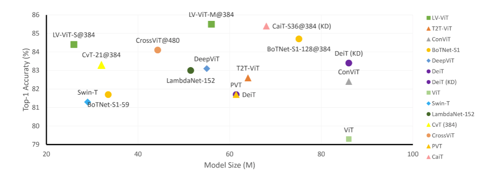
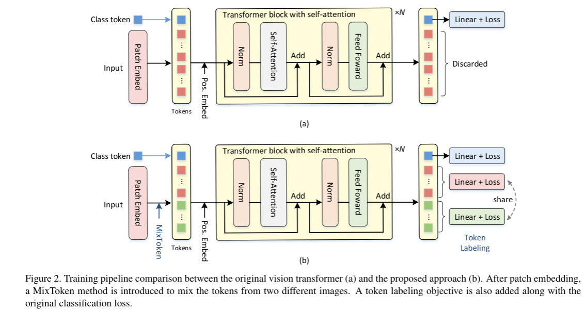

# Token Labeling

#### Training a 85.4% Top-1 Accuracy Vision Transformer with 56M Parameters on ImageNet

This is a Pytorch implementation of our Technical report ([arxiv](https://arxiv.org/abs/2104.10858)). 




Comparison between the proposed LV-ViT and other recent works based on transformers. Note that we only show models whose model sizes are under 100M.

#### Training Pipeline



Our codes are based on the [pytorch-image-models](https://github.com/rwightman/pytorch-image-models) by [Ross Wightman](https://github.com/rwightman).

#### LV-ViT Models

| Model                           | layer | dim  | Image resolution |  Param  | Top 1 |Download |
| :------------------------------ | :---- | :--- | :--------------: |-------: | ----: |   ----: |
| LV-ViT-S                        | 16    | 384  |       224        |  25.77M |  83.3 |[link](https://drive.google.com/file/d/1QQL7sjj41BhjCO4OdDTDgD7u00Guuo1j/view?usp=sharing) |
| LV-ViT-S                        | 16    | 384  |       384        |  26.30M |  84.4 |[link](https://drive.google.com/file/d/1Q1rdCbQTFiB1OjvKYzECcNodbjcdW_FA/view?usp=sharing) |
| LV-ViT-M                        | 20    | 512  |       224        |  55.83M |  84.0 |[link](https://drive.google.com/file/d/1uPDBtkriLm7mEB-tx3nYpWncjD-R0ulC/view?usp=sharing) |
| LV-ViT-M                        | 20    | 512  |       384        |  56.03M |  85.4 |[link](https://drive.google.com/file/d/1mgKpRXXIpudVSeCM1w85_ZuNcMesIRMW/view?usp=sharing) |
| LV-ViT-L                        | 24    | 768  |       448        | 150.47M |  86.2 |[link](https://drive.google.com/file/d/1VUv1uSpnd5lcf_EVEPi4bdLhG7bP5p85/view?usp=sharing) |

# requirements

torch>=1.4.0
torchvision>=0.5.0
pyyaml
timm==0.4.5

data prepare: ImageNet with the following folder structure, you can extract imagenet by this [script](https://gist.github.com/BIGBALLON/8a71d225eff18d88e469e6ea9b39cef4).

```
│imagenet/
├──train/
│  ├── n01440764
│  │   ├── n01440764_10026.JPEG
│  │   ├── n01440764_10027.JPEG
│  │   ├── ......
│  ├── ......
├──val/
│  ├── n01440764
│  │   ├── ILSVRC2012_val_00000293.JPEG
│  │   ├── ILSVRC2012_val_00002138.JPEG
│  │   ├── ......
│  ├── ......
```

#### 3. Validation
Replace DATA_DIR with your imagenet validation set path and MODEL_DIR with the checkpoint path
```
CUDA_VISIBLE_DEVICES=0 bash eval.sh /path/to/imagenet/val /path/to/checkpoint
```

#### 4. Label data

We provide NFNet-F6 generated dense label map [here](https://drive.google.com/file/d/1Cat8HQPSRVJFPnBLlfzVE0Exe65a_4zh/view?usp=sharing).


#### 4. Training

Coming soon

#### Related projects
[T2T-ViT](https://github.com/yitu-opensource/T2T-ViT/), [Re-labeling ImageNet](https://github.com/naver-ai/relabel_imagenet).
